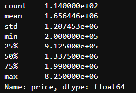
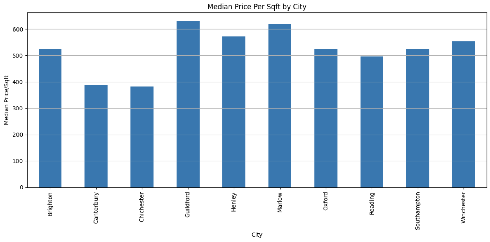

# 🏘 Housing prices forecast -- UK 🇬🇧 (southeast) [updating daily!]
```
Forecasting housing prices in the UK South Eastern Area using the data scraped from Savills
```
## 🖼️ A small background of this project
My family has recently moved to the UK and is currently looking at houses in the Southeast. It's been a bit of a struggle like it is for everyone when making a big purchase. So, I've decided to do some extra research on the area we're interested in. By collecting additional information and gaining a broader perspective, I aim for us to reach a data-driven conclusion.

## 👨🏻‍💻 Where do I get these data & How do I deal with them
Scraping Housing Data [webscraper.io](https://webscraper.io/): This enabled me to conveniently gather different pieces of information from each listing using a point-and-click interface. The 113 properties' data was scraped from Savills -- the most informative real estate website I've found online (for the UK area).

Go ahead & take a look at [this](https://webscraper.io/tutorials) link if you want to scrape data from the other websites. 

Web scraping is performed by powerful software which can put a heavy load on website servers. You should make sure that you achieve the optimal rate of the web scraping process so the bandwidth and performance of the web server will not be affected -- Happy Scraping & Scrape ethically! :)

By the way, the scraped data is shown in the `housing_data` folder, feel free to check them out if you're curious about the format.  

## ⚙️ Installation guide
Python, Jupyter Notebook, and -pip install every toolkit mentioned in the notebook are everything you need. Download the 

`SE_housing.ipynb` file and all the .csv files in the `housing_data` file and run them in the notebook. Here are the libraries used: 

a. Pandas

b. Scikit Learn

c. Numpy

d. Seaborn

e. Matpoltlib

f. Datetime

g. Geopy

h. Scipy

i. Plotly.express

## 🔬 Exploratory Data Analysis (EDA)
The following figures show the statistics and the distributions of housing prices in the Southeast area

Visualization of housing price distribution: The majority of our properties fall within the price range of 500,000 to 2.25 million pounds.




The correlations between the price and other independent variables are best shown as a heatmap and a pair plot


In a single box of a heatmap, max value = 1, the greater the value means the more correlated between 2 variables.

While negative values may indicate that the two variables have an inverse correlation.


I also want to know the median housing prices categorised by city. Southampton stood out prominently, with Brighton and Guildford 

receiving an honourable mention.


However, when we shift our focus on the price/sqft basis, we see that Guildford and Marlow are the two marginally highest-priced locations.

This means that although gross prices are the highest in Southampton and Brighton, buyers are getting relatively good deals in that they are

"receiving a decent value for their input" for their homes in those two cities. In fact, if you check the `median_price_by_city` inside the

`output_charts` folder, you'll see the median sqft of homes in each city. Brighton and Southampton feature the largest homes in addition to

having the highest overall prices.

## 𝌭 Regression Modelling for housing price prediction
Simple linear regression:

When variable A is correlated to a single variable B, it can be represented as $A = β_0 + β_1*B_1$

For someone without a mathematical background, you can interpret this equation simply as when one variable increases, another follows, and vice versa. 

We can also comprehend it as a straight-line equation when $β_0$ is the intercept and $β_1$ is the slope of the line.

In this project, we adopted multiple linear regression as the prediction for the dependent variable `price`, as it is a dependent variable affected by more than one independent variable, which can be represented as 

$A = β_0 + β_1*B_1 + β_2*B_2 + ... + β_n*B_n$

The calculation involved is more complex than simple linear regression, but thanks to the Python `sci-kit learn` package we can complete the analysis in a comparatively easier manner.  
